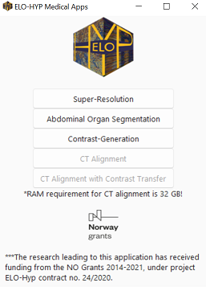

### Medical-Image Application

This repo contains the medical-image GUI.

The application contains:
- Medical image super-resolution for CT and MRI.
- Abdominal organ segmentation.
- Contrast Generation (Native <-> Arterial, etc).
- CT aligment.
- CT aligment with Contrast Transfer.

## Steps to run the code:

Step 1: Download the resourses and the test samples from [here](https://drive.google.com/drive/folders/1ml7GpMM3j1XxB3X130G1zS3NF4ompakw?usp=sharing.).

The resources folder contains the pretrained models. Place the resources next to this code. The ```test_samples``` folder contains a few dicom samples for test purposes.

Step 2.1: Run the code

    python app.py


Requirements to run the application:

- pytorch
- onnxruntime
- PIL
- pydicom
- matplotlib
- opencv

Optional steps:
- Create executable from code:

        pyinstaller app.py --onefile  -F --hiddenimport=pydicom.encoders.gdcm --hiddenimport=pydicom.encoders.pylibjpeg

- Create executable from code (<i>without the  back console</i>):
        
        pyinstaller app.py --onefile  -F --hiddenimport=pydicom.encoders.gdcm --hiddenimport=pydicom.encoders.pylibjpeg --noconsole


## Steps to use the application as exe:

Step 1: 
    Download the exe from [here](https://drive.google.com/file/d/1Zen3oRqenVi1U4lJFqqbTY2n9lkxXFwA/view?usp=sharing).
    
   Click on ``app.exe``, then start using the application.
    
 
  .


